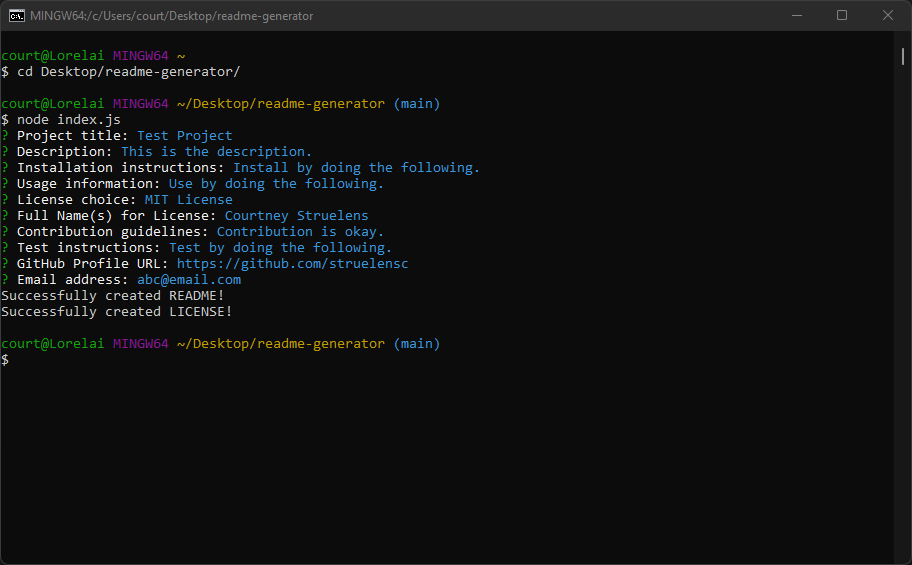
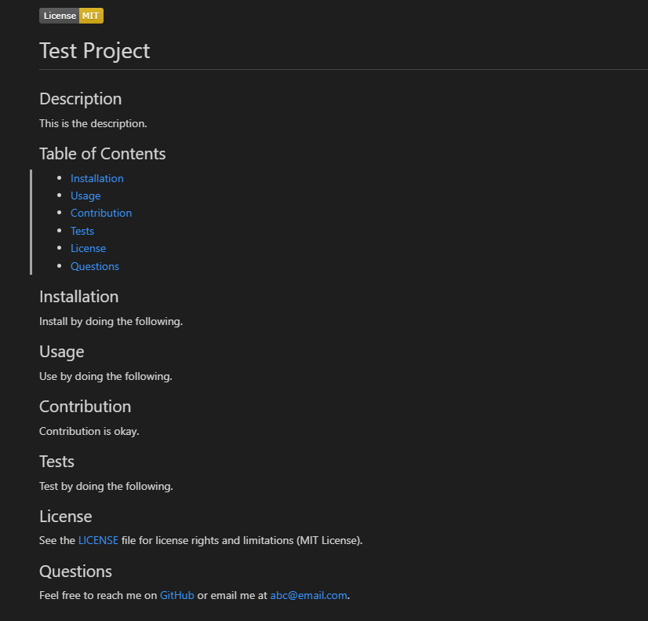
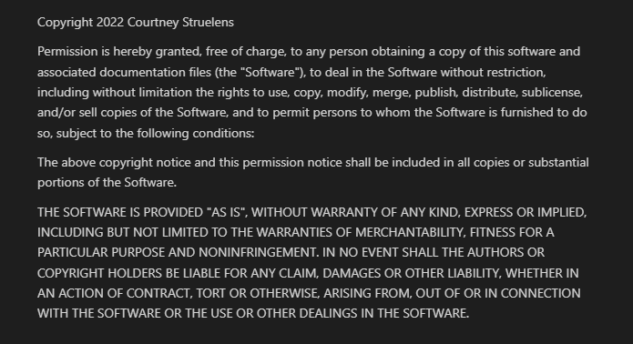

[](https://opensource.org/licenses/MIT)

# readme-generator

## Description

This is a Node.js command-line application that asks the user a series of prompts about the project they would like to generate a README for. The prompt answers will be used to generate a README file with proper markdown as well as a LICENSE file.

This application serves to save time for the user by providing a user with a README with proper markdown based on the user's input. The user then can use the README out of the box or customize it further to fit their needs.

The purpose of this project was to practice writing command-line applications in javascript.

## Table of Contents

- [Installation](#installation)
- [Usage](#usage)
- [Deployment](#deployment)
- [License](#license)
- [Questions](#questions)

## Installation

You will need to have Node.js already installed on your computer.

1. Navigate to the "<> Code" tab of the project.
1. Click on the "Code" button on the right. A dropdown should appear.
1. Under "Clone", "HTTPS" should be selected.
1. Select "Download ZIP"
1. Extract the folder to where you'd like to save the readme-generator.
1. Using your console, navigate to the folder.
1. Once inside the folder in your console run the below command to install required node modules.
1. The readme-generator is ready for use.

## Usage

1. Open your preferred console.
1. Navigate to where you saved the readme-generator.
1. Once you're inside the folder in your console, use the below command to launch the application.

```
node index.js
```

4. A series of prompts will ask you questions about your project. Type your answer and click enter to move on to the next prompt. You can choose not to answer any prompt by just clicking enter. If you choose not to answer a prompt, that section of the README won't be generated.
1. Once all the prompts have been processed, your files will be saved within the readme-generator folder in the generated-files folder.

See below for a walk-through video.

https://youtu.be/SKkhkofAtQg

## Deployment

Console Activity:



Sample README: [README File](./assets/Sample-README.md)



Sample LICENSE: [LICENSE FILE](./assets/Sample-LICENSE.md)



## License

See the [LICENSE](LICENSE.md) file for license rights and limitations (MIT License).

## Questions

Feel free to reach me on [GitHub](https://github.com/struelensc).
